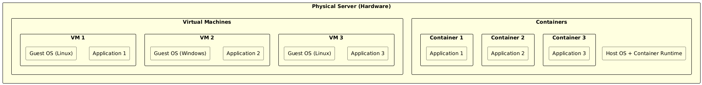

# Sessioon 2: Virtualiseerimise kontseptsioonid

### 2.1 Virtualiseerimise tutvustus

**Kirjeldus**:  
Virtualiseerimine on tehnoloogia, mis võimaldab käitada ühte füüsilist serverit mitme **virtuaalse masinaga (VM)**. Need virtuaalsed masinad käituvad nagu sõltumatud arvutid oma operatsioonisüsteemide ja rakendustega. Sisuliselt on see nagu mitme "arvuti" omamine ühe füüsilise masina sees, kus kõik töötavad samaaegselt ilma eraldi riistvarata.

#### **Eelised**:

1. **Kulude kokkuhoid**:  
   Virtualiseerimine vähendab vajadust mitme füüsilise serveri järele. Selle asemel, et osta ja hooldada mitut serverit, saab ettevõte käitada mitut virtuaalset masinat ühe serveri peal. Näiteks selle asemel, et osta viis füüsilist serverit, saab ettevõte kasutada ühte võimsat serverit, et majutada viis virtuaalset keskkonda.

2. **Ressursside tõhus kasutamine**:  
   Füüsilised serverid on tihti alakoormatud. Virtualiseerimine võimaldab ettevõtetel kasutada serveri ressursse tõhusamalt, jagades serveri erinevatele virtuaalmasinatele. See maksimeerib jõudlust ja vähendab raiskamist.

3. **Skaleeritavus**:  
   Virtualiseerimine muudab ettevõtete IT-infrastruktuuri skaleerimise lihtsaks. Kui on vaja lisada uusi teenuseid või rakendusi, saab kiiresti luua uusi virtuaalmasinaid olemasolevatel serveritel.

4. **Isoleeritus**:  
   Iga virtuaalne masin töötab isoleeritult teistest. Kui üks virtuaalmasin jookseb kokku või tekib turvarikkumine, ei mõjuta see teisi. Näiteks kui üks VM haldab veebiserverit ja teine andmebaasi, siis veebiserveri kokkujooksmine ei mõjuta andmebaasi VM-i.

*Füüsiline server VM'idega*

---

### 2.2 Virtuaalmasinad (VM) vs konteinerid

Virtuaalmasinad ja konteinerid on populaarsed valikud rakenduste haldamisel. Siin on nende omadused ja erinevused.

#### 1. **Virtuaalmasinad (VM)**:
- **Emuleerivad tervet operatsioonisüsteemi**:  
  VM-id töötavad täisväärtusliku operatsioonisüsteemiga, mis jookseb host-süsteemi peal.
  
- **Pühendatud ressursid**:  
  Iga VM saab oma osa hosti ressurssidest (CPU, RAM, salvestusruum), pakkudes isoleeritust.

- **Aeglasem käivitamine**:  
  Kuna VM-id emuleerivad kogu operatsioonisüsteemi, võtab nende käivitamine rohkem aega kui konteinerite puhul.

#### 2. **Konteinerid**:
- **Jagavad sama OS-tuumat**:  
  Konteinerid ei tööta oma operatsioonisüsteemiga, vaid jagavad hosti OS-tuumat.

- **Kerged ja kiired**:  
  Konteinerid on kergemad ja käivituvad kiiremini, kuna neil pole vaja eraldi operatsioonisüsteemi.

- **Ideaalne mikroteenuste jaoks**:  
  Konteinerid sobivad hästi mikroteenuste arhitektuurile, kus iga teenus töötab oma konteineris.

*Virtuaalmasinate ja konteinerite võrdlus*

---

### 2.3 Virtualiseerimistarkvara

Virtualiseerimist võimaldavad tarkvarad jagunevad peamiselt hüperviisoriteks ja konteineriplatvormideks.

#### 1. **Hüperviisorid**:
- **Tüüp 1 (Bare-metal)**:  
  Installitakse otse riistvarale ja pakuvad otsest juurdepääsu ressurssidele, näiteks **VMware ESXi** ja **Microsoft Hyper-V**.

- **Tüüp 2 (Hosted)**:  
  Töötab olemasoleva operatsioonisüsteemi peal. Näiteks **VirtualBox** ja **VMware Workstation**.

#### 2. **Konteineriplatvormid**:
- **Docker**:  
  Pakub konteinerite loomise ja haldamise võimalust.

- **Kubernetes**:  
  Platvorm konteinerite orkestreerimiseks ja haldamiseks.

*Docker ja Kubernetes*

---

## [Lab 1: Virtuaalmasina seadistamine](../labs/lab_01_VM_Setup/lab_01_Setting_Up_a_VM.md)
*See labor keskendub virtuaalmasina seadistamisele kasutades VirtualBoxi.*

*VirtualBoxi ja virtuaalmasina seadistamise protsess*
