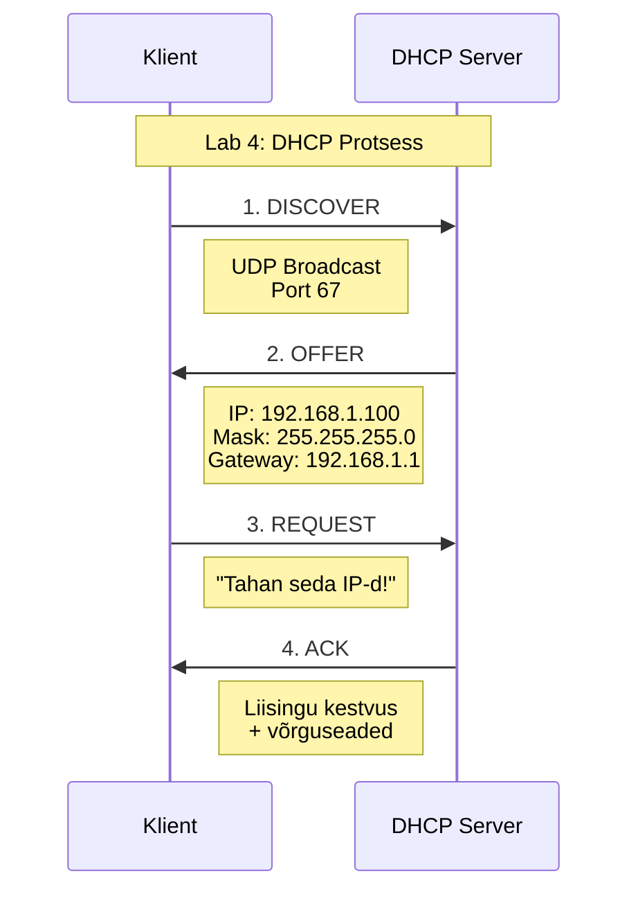
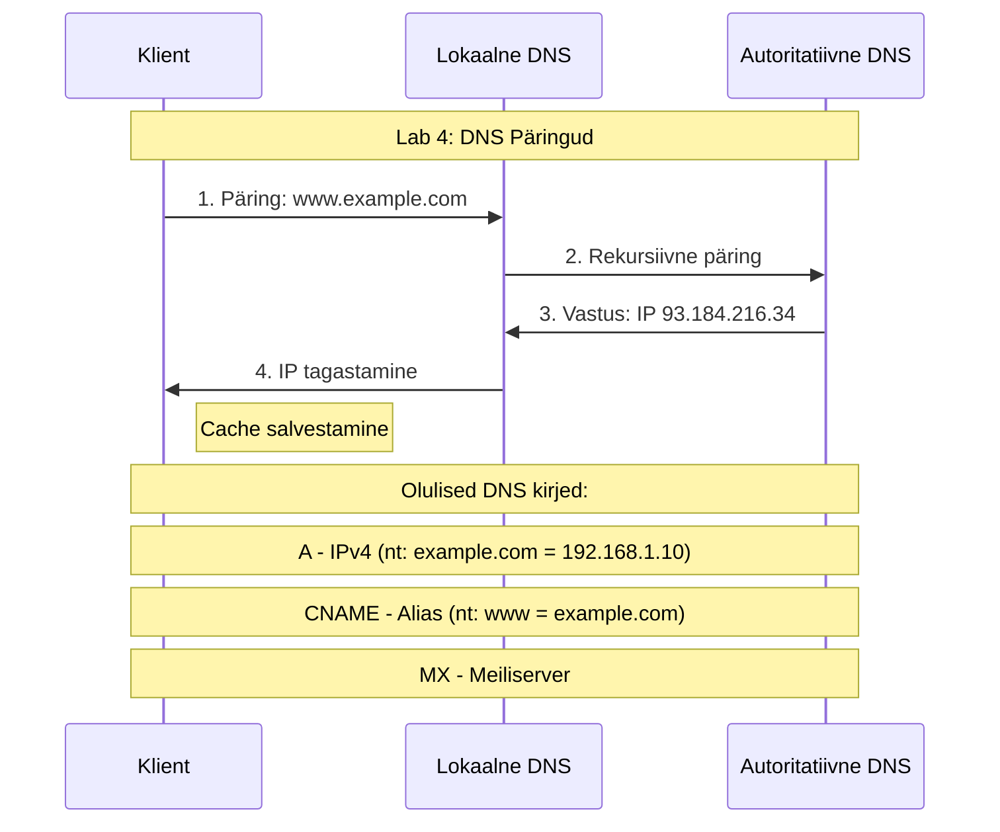

# Võrguinfrastruktuur, DHCP ja DNS

## 1. Õppematerjali eesmärgid 🎯

Pärast selle materjali läbitöötamist:
- Mõistate erinevaid võrgutüüpe ja nende kasutuskohti
- Saate aru DHCP tööpõhimõtetest ja konfigureerimisest
- Oskate seadistada ja hallata DNS serverit
- Suudate tuvastada ja lahendada tavalisi võrguprobleeme

## 2. Võrgutüübid ja Infrastruktuur 🌐

### 2.1 Võrgutüüpide ülevaade

### 2.2 Võrgutüüpide detailne kirjeldus

#### 2.2.1 LAN (Local Area Network)
- **Definitsioon**: Piiratud geograafilise ala võrk
- **Omadused**:
  - Kiirus: 10 Mbps kuni 10 Gbps
  - Madal latentsus: < 1ms
  - Kõrge turvalisus: füüsiliselt piiratud
- **Kasutuskohad**:
  - Kontorivõrgud
  - Koolivõrgud
  - Koduvõrgud
- **Eelised**:
  - Kiire andmeedastus
  - Lihtne hallata
  - Madal kulu

#### 2.2.2 WAN (Wide Area Network)
- **Definitsioon**: Geograafiliselt hajutatud võrkude ühendus
- **Tehnoloogiad**:
  - MPLS (Multiprotocol Label Switching)
  - SD-WAN (Software-Defined WAN)
  - VPN (Virtual Private Network)
- **Kasutuskohad**:
  - Rahvusvahelised ettevõtted
  - Pankade võrgud
  - Riigiasutuste võrgud
- **Väljakutsed**:
  - Kõrgem latentsus
  - Keerulisem haldamine
  - Suuremad kulud

#### 2.2.3 VLAN (Virtual LAN)
- **Definitsioon**: Loogiline võrgu segmenteerimine
- **Omadused**:
  - IEEE 802.1Q standard
  - VLAN ID: 1-4094
  - Paindlik konfiguratsioon
- **Kasutamise põhjused**:
  - Turvalisuse tõstmine
  - Liikluse eraldamine
  - Ressursside optimeerimine
- **Näited**:
  ```
  VLAN 10: Administratsioon (kõrge turvalisus)
  VLAN 20: Töötajad (tavaline turvalisus)
  VLAN 30: Külalised (piiratud ligipääs)
  ```

#### 2.2.4 WLAN (Wireless LAN)
- **Definitsioon**: Traadita kohtvõrk
- **Standardid**:
  - IEEE 802.11a/b/g/n/ac/ax
- **Turvameetmed**:
  - WPA3 krüpteering
  - MAC filtreerimine
  - 802.1X autentimine
- **Planeerimise aspektid**:
  - Leviala
  - Interferents
  - Kasutajate arv

## 3. DHCP (Dynamic Host Configuration Protocol) 🎟️

### 3.1 DHCP protsessi skeem



### 3.2 DHCP komponendid ja funktsioonid

#### 3.2.1 DHCP põhimõisted

**Scope (Ulatus)**
- Scope on IP-aadresside vahemik, mida DHCP server saab jagada
- Näiteks: 192.168.1.0/24 tähendab aadresse vahemikus 192.168.1.1 kuni 192.168.1.254
- Ühes võrgus võib olla mitu scope'i erinevate seadmete gruppide jaoks
- Scope määrab:
  - IP-aadresside vahemiku
  - Alamvõrgu maski
  - Vaikelüüsi (Default Gateway)
  - DNS serverite aadressid
  - Lease time (liisingu aeg)

**Lease (Liising)**
- Liising on ajavahemik, mille jooksul seade võib kasutada talle määratud IP-aadressi
- Tüüpilised liisingu ajad:
  - 24 tundi tavakasutajatele
  - 8 tundi külalisvõrkudes
  - 1 nädal statsionaarsetele seadmetele
- Liisingu protsess:
  1. Klient saab IP-aadressi ja liisingu aja
  2. 50% liisingu ajast möödudes proovib klient liisingut uuendada
  3. 87.5% ajast möödudes proovib uuesti
  4. Kui uuendamine ebaõnnestub, peab klient IP vabastama

**Exclusion Range (Välistatud vahemik)**
- IP-aadressid, mida DHCP server ei tohi välja jagada
- Kasutatakse seadmetele, mis vajavad staatilisi IP-aadresse:
  - Printerid
  - Serverid
  - Võrguseadmed
- Näide: 192.168.1.1-192.168.1.10 on reserveeritud võrguseadmetele

#### 3.2.2 DHCP Server funktsioonid

**1. IP-aadresside haldamine**
```plaintext
Pool Management (IP-aadresside haldus):
- Vaba IP leidmine
- IP-de reserveerimine
- Konfliktide tuvastamine
- IP-aadresside taaskasutamine
```

**2. Võrguseadete jagamine**
```plaintext
Kohustuslikud parameetrid:
- IP-aadress
- Alamvõrgu mask
- Liisingu kestvus

Lisaparameetrid (DHCP Options):
- Option 3: Default Gateway
- Option 6: DNS Serverid
- Option 15: Domain Name
- Option 44: WINS Serverid
- Option 51: Lease Time
```

**3. Liisingu haldamine**
```plaintext
Liisingu olekud:
1. SELECTING: Klient otsib DHCP serverit
2. REQUESTING: Klient taotleb IP-aadressi
3. BOUND: IP on määratud ja aktiivne
4. RENEWING: Liisingu uuendamine
5. REBINDING: Uue liisingu taotlemine
```

#### 3.2.3 DHCP Kliendi seadistamine

**Automaatne seadistus (DHCP klient)**
```plaintext
1. Network Interface seaded:
   - "Obtain IP address automatically"
   - "Obtain DNS server automatically"

2. Liisingu protsess:
   DISCOVER → OFFER → REQUEST → ACK
```

**Käsud liisingu haldamiseks**
```bash
# Windows
ipconfig /release     # Vabasta praegune IP
ipconfig /renew       # Hangi uus IP
ipconfig /all         # Vaata DHCP infot

# Linux
sudo dhclient -r      # Vabasta IP
sudo dhclient         # Hangi uus IP
ip addr show          # Vaata võrguseadeid
```

#### 3.2.4 DHCP Relay Agent

DHCP Relay on vajalik, kui:
- DHCP server ja klient on eri võrkudes
- Soovime kasutada ühte tsentraalset DHCP serverit

```plaintext
Relay Agendi töö:
1. Võtab vastu kliendi DISCOVER paketi
2. Lisab oma info (giaddr)
3. Edastab päringu DHCP serverile
4. Vahendab vastuse kliendile
```

#### 3.2.5 DHCP Turvalisus

**Turvaprobleemid ja lahendused:**
```plaintext
1. Rogue DHCP Server:
   - DHCP snooping
   - Port security

2. IP/MAC Spoofing:
   - DHCP snooping binding table
   - IP Source Guard
   - Dynamic ARP Inspection

3. DHCP Starvation Attack:
   - Port security
   - DHCP rate limiting
```
## 4. DNS (Domain Name System) 🗺️

### 4.1 DNS päringu protsess



### 4.2 DNS (Domain Name System) põhjalik ülevaade

#### 4.2.1 DNS põhimõisted

**Tsoonid (Zones)**
```plaintext
1. Forward Lookup Zone:
   - Teisendab domeeninimed IP-aadressideks
   - Näide: example.com → 192.168.1.10

2. Reverse Lookup Zone:
   - Teisendab IP-aadressid domeeninimedeks
   - Näide: 192.168.1.10 → example.com
   - Kasutatakse PTR kirjeid
```

**DNS kirjete tüübid detailselt**
```plaintext
1. A (Address Record):
   - IPv4 aadressi määramine
   - Näide: server.example.com IN A 192.168.1.10
   - TTL: Time To Live (kui kaua vahemälus hoitakse)

2. AAAA (IPv6 Address Record):
   - IPv6 aadressi määramine
   - Näide: server.example.com IN AAAA 2001:db8::1

3. CNAME (Canonical Name):
   - Aliase loomine
   - Näide: www IN CNAME server.example.com
   - Kasutatakse teenuste suunamiseks

4. MX (Mail Exchange):
   - Meiliserveri määramine
   - Prioriteediga (madalam number = kõrgem prioriteet)
   - Näide: example.com IN MX 10 mail.example.com

5. TXT (Text Record):
   - Tekstiinfo salvestamine
   - Kasutatakse:
     * SPF (Sender Policy Framework)
     * DKIM (DomainKeys Identified Mail)
     * DMARC (Domain-based Message Authentication)

6. NS (Name Server):
   - Tsooni nimeserverite määramine
   - Näide: example.com IN NS ns1.example.com

7. SOA (Start of Authority):
   - Tsooni põhiinfo
   - Sisaldab:
     * Primary nameserver
     * Administrator email
     * Serial number
     * Refresh, retry, expire times
```

#### 4.2.2 DNS hierarhia

```plaintext
DNS hierarhia tasemed:
1. Root (.)
2. Top Level Domain (.com, .org, .ee)
3. Second Level Domain (example.com)
4. Subdomain (blog.example.com)

Päringute liikumine:
www.example.com päring →
1. Root DNS (.)
2. .com TLD server
3. example.com autoritatiivne server
4. Vastus: www.example.com IP
```

# DNS Hierarhia

```
                                    . (Root DNS)
                                         |
                    +--------------------+-------------------+
                    |                    |                  |
                  .com                 .org                .ee
                    |                    |                  |
        +-----------+----------+         |          +-------+-------+
        |           |          |     debian.org     |             |
    google.com  example.com  microsoft.com       riik.ee     taltech.ee
                    |
            +-------+-------+
            |       |       |
           www    mail    blog
```

## DNS päringu protsess: www.example.com

```
1. Klient → Rekursiivne DNS Server: "Kus on www.example.com?"
   |
2. Rekursiivne Server → Root DNS: "Kus on .com?"
   |
3. Root DNS → Rekursiivne: ".com serverite aadressid"
   |
4. Rekursiivne → .com DNS: "Kus on example.com?"
   |
5. .com DNS → Rekursiivne: "example.com serverite aadressid"
   |
6. Rekursiivne → example.com DNS: "Kus on www.example.com?"
   |
7. example.com DNS → Rekursiivne: "www.example.com = 192.168.1.10"
   |
8. Rekursiivne → Klient: "www.example.com = 192.168.1.10"
```

## DNS hierarhia tasemed

```
Tase 1: Root (.)
        ↓
Tase 2: Top Level Domain (.com, .org, .ee)
        ↓
Tase 3: Second Level Domain (example.com)
        ↓
Tase 4: Subdomain (www.example.com)
```
#### 4.2.3 DNS serverite tüübid

**1. Rekursiivne DNS server**
```plaintext
Funktsioonid:
- Teeb päringuid teistele serveritele
- Hoiab vastuseid vahemälus (cache)
- Teenindab klientide päringuid

Seadistamine:
- Forwarders (edastuserverid)
- Root hints (juureserverite info)
- Cache settings (vahemälu seaded)
```

**2. Autoritatiivne DNS server**
```plaintext
Funktsioonid:
- Hoiab tsooni originaalkirjeid
- Vastab otse oma tsooni päringutele
- Ei tee rekursiivseid päringuid

Seadistamine:
- Zone files (tsoonifailid)
- Permissions (õigused)
- Zone transfers (tsooni ülekanded)
```

#### 4.2.4 DNS vahemälu (Cache)

**Vahemälu tööpõhimõte**
```plaintext
1. Positive Cache:
   - Õnnestunud päringute vastused
   - TTL põhine aegumisaeg
   - Vähendab koormust

2. Negative Cache:
   - Ebaõnnestunud päringute vastused
   - Eraldi TTL mitteleiduvate kirjete jaoks
   - Kaitseb ülekoormuse eest
```

#### 4.2.5 DNS turvalisus

**Turvaprobleemid ja lahendused:**
```plaintext
1. Cache Poisoning:
   - DNSSEC kasutamine
   - Randomized Query ID
   - Source Port Randomization

2. Zone Transfer:
   - AXFR (täielik ülekanne) piiramine
   - IXFR (inkrementaalne ülekanne)
   - ACL-ide kasutamine

3. DDoS kaitse:
   - Rate limiting
   - Response Rate Limiting (RRL)
   - Anycast DNS
```

#### 4.2.6 DNS diagnostika käsud

```bash
# Windows
nslookup example.com          # Põhipäring
nslookup -type=MX example.com # MX kirjete päring
ipconfig /displaydns          # Vaata DNS cache
ipconfig /flushdns           # Tühjenda DNS cache

# Linux
dig example.com              # Detailne DNS päring
dig MX example.com          # MX kirjete päring
dig +trace example.com      # Jälgi päringut
systemd-resolve --statistics # Vaata DNS statistikat
```

#### 4.2.7 Näide: Tüüpiline DNS konfiguratsioon

```plaintext
# Primary Zone Configuration
example.com. IN SOA ns1.example.com. admin.example.com. (
    2024042401 ; Serial
    3600       ; Refresh (1 hour)
    1800       ; Retry (30 minutes)
    604800     ; Expire (1 week)
    86400      ; Minimum TTL (1 day)
)

# Essential Records
example.com.     IN NS   ns1.example.com.
example.com.     IN NS   ns2.example.com.
example.com.     IN A    192.168.1.10
www.example.com. IN A    192.168.1.10
mail.example.com. IN A    192.168.1.20
example.com.     IN MX   10 mail.example.com.
```

## 5. Laborid 🔬

###  Lab 4: DHCP & DNS seadistamine

### 5.2 Tavalised probleemid ja lahendused

#### 5.2.1 DHCP probleemid
- **Sümptom**: "Ei saa IP-aadressi"
  ```
  Kontroll: ipconfig /all
  Lahendus: ipconfig /release && ipconfig /renew
  ```

#### 5.2.2 DNS probleemid
- **Sümptom**: "Ei lahenda domeeninimesid"
  ```
  Kontroll: nslookup example.com
  Lahendus: ipconfig /flushdns
  ```

## 6. Lisamaterjalid 📚

- RFC 2131 (DHCP)
- RFC 1034, 1035 (DNS)
- Cisco CCNA materjalid
- Microsoft TechNet artiklid
