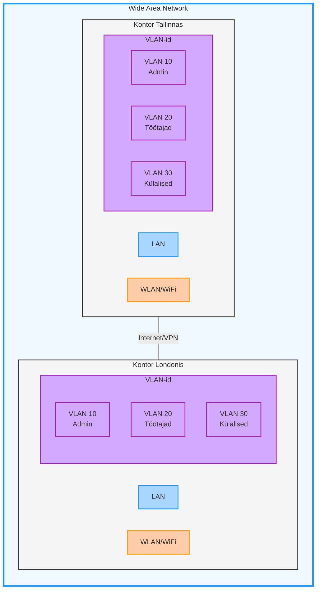
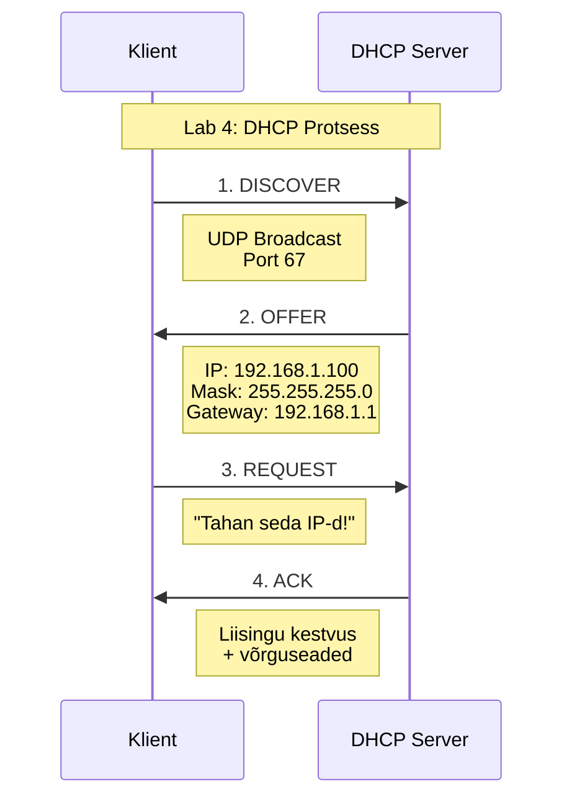
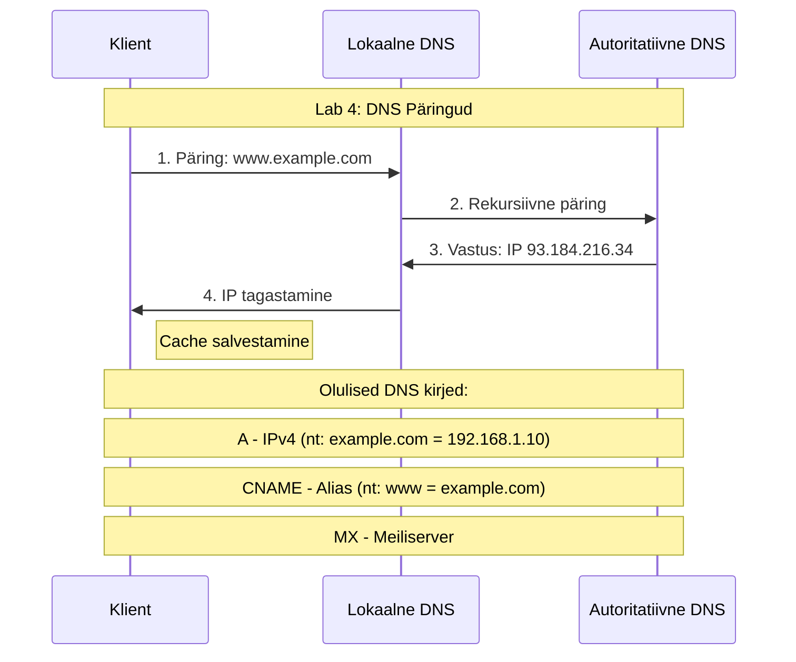

# Võrguinfrastruktuur, DHCP ja DNS

## 1. Õppematerjali eesmärgid 🎯

Pärast selle materjali läbitöötamist:
- Mõistate erinevaid võrgutüüpe ja nende kasutuskohti
- Saate aru DHCP tööpõhimõtetest ja konfigureerimisest
- Oskate seadistada ja hallata DNS serverit
- Suudate tuvastada ja lahendada tavalisi võrguprobleeme

## 2. Võrgutüübid ja Infrastruktuur 🌐

### 2.1 Võrgutüüpide ülevaade



### 2.2 Võrgutüüpide detailne kirjeldus

#### 2.2.1 LAN (Local Area Network)
- **Definitsioon**: Piiratud geograafilise ala võrk
- **Omadused**:
  - Kiirus: 10 Mbps kuni 10 Gbps
  - Madal latentsus: < 1ms
  - Kõrge turvalisus: füüsiliselt piiratud
- **Kasutuskohad**:
  - Kontorivõrgud
  - Koolivõrgud
  - Koduvõrgud
- **Eelised**:
  - Kiire andmeedastus
  - Lihtne hallata
  - Madal kulu

#### 2.2.2 WAN (Wide Area Network)
- **Definitsioon**: Geograafiliselt hajutatud võrkude ühendus
- **Tehnoloogiad**:
  - MPLS (Multiprotocol Label Switching)
  - SD-WAN (Software-Defined WAN)
  - VPN (Virtual Private Network)
- **Kasutuskohad**:
  - Rahvusvahelised ettevõtted
  - Pankade võrgud
  - Riigiasutuste võrgud
- **Väljakutsed**:
  - Kõrgem latentsus
  - Keerulisem haldamine
  - Suuremad kulud

#### 2.2.3 VLAN (Virtual LAN)
- **Definitsioon**: Loogiline võrgu segmenteerimine
- **Omadused**:
  - IEEE 802.1Q standard
  - VLAN ID: 1-4094
  - Paindlik konfiguratsioon
- **Kasutamise põhjused**:
  - Turvalisuse tõstmine
  - Liikluse eraldamine
  - Ressursside optimeerimine
- **Näited**:
  ```
  VLAN 10: Administratsioon (kõrge turvalisus)
  VLAN 20: Töötajad (tavaline turvalisus)
  VLAN 30: Külalised (piiratud ligipääs)
  ```

#### 2.2.4 WLAN (Wireless LAN)
- **Definitsioon**: Traadita kohtvõrk
- **Standardid**:
  - IEEE 802.11a/b/g/n/ac/ax
- **Turvameetmed**:
  - WPA3 krüpteering
  - MAC filtreerimine
  - 802.1X autentimine
- **Planeerimise aspektid**:
  - Leviala
  - Interferents
  - Kasutajate arv

## 3. DHCP (Dynamic Host Configuration Protocol) 🎟️

### 3.1 DHCP protsessi skeem



### 3.2 DHCP komponendid ja funktsioonid

#### 3.2.1 DHCP Server
- **Põhifunktsioonid**:
  - IP-aadresside haldamine
  - Võrguseadete jagamine
  - Liisingu haldamine
- **Konfigureeritavad parameetrid**:
  ```
  Scope: 192.168.1.0/24
  Range: 192.168.1.100 - 192.168.1.200
  Lease Time: 24h
  Exclusions: 192.168.1.1-192.168.1.10
  ```

#### 3.2.2 DHCP Klient
- **Põhifunktsioonid**:
  - DHCP avastamine
  - IP-aadressi taotlemine
  - Liisingu uuendamine
- **Olulised käsud**:
  ```
  ipconfig /release    # Vabasta IP
  ipconfig /renew      # Uuenda IP
  ipconfig /all        # Vaata seadeid
  ```

## 4. DNS (Domain Name System) 🗺️

### 4.1 DNS päringu protsess



### 4.2 DNS kirjete tüübid

| Kirje tüüp | Kasutus | Näide |
|------------|---------|--------|
| A | IPv4 aadress | example.com = 192.168.1.10 |
| AAAA | IPv6 aadress | example.com = 2001:db8::1 |
| CNAME | Alias | www = example.com |
| MX | Meiliserver | mail.example.com |
| TXT | Tekst | SPF, DKIM info |
| PTR | Reverse lookup | 192.168.1.10 = example.com |

### 4.3 DNS server tüübid
1. **Rekursiivne server**
   - Teeb päringuid teistele serveritele
   - Salvestab vastused vahemällu
   - Näide: ISP DNS server

2. **Autoritatiivne server**
   - Hoiab originaal DNS kirjeid
   - Vastab ainult oma tsooni päringutele
   - Näide: example.com nimeserver

## 5. Laborid ja Praktika 🔬

### 5.1 Lab 4: DHCP & DNS seadistamine
- DHCP serveri installimine
- IP-aadresside vahemiku määramine
- DNS kirjete loomine
- Testimine ja tõrkeotsing

### 5.2 Tavalised probleemid ja lahendused

#### 5.2.1 DHCP probleemid
- **Sümptom**: "Ei saa IP-aadressi"
  ```
  Kontroll: ipconfig /all
  Lahendus: ipconfig /release && ipconfig /renew
  ```

#### 5.2.2 DNS probleemid
- **Sümptom**: "Ei lahenda domeeninimesid"
  ```
  Kontroll: nslookup example.com
  Lahendus: ipconfig /flushdns
  ```

## 6. Kokkuvõte 📝

Selles peatükis õppisime:
1. Erinevaid võrgutüüpe ja nende kasutamist
2. DHCP tööpõhimõtteid ja seadistamist
3. DNS süsteemi struktuuri ja haldamist
4. Praktilisi oskusi läbi laboritöö

## 7. Lisamaterjalid 📚

- RFC 2131 (DHCP)
- RFC 1034, 1035 (DNS)
- Cisco CCNA materjalid
- Microsoft TechNet artiklid
