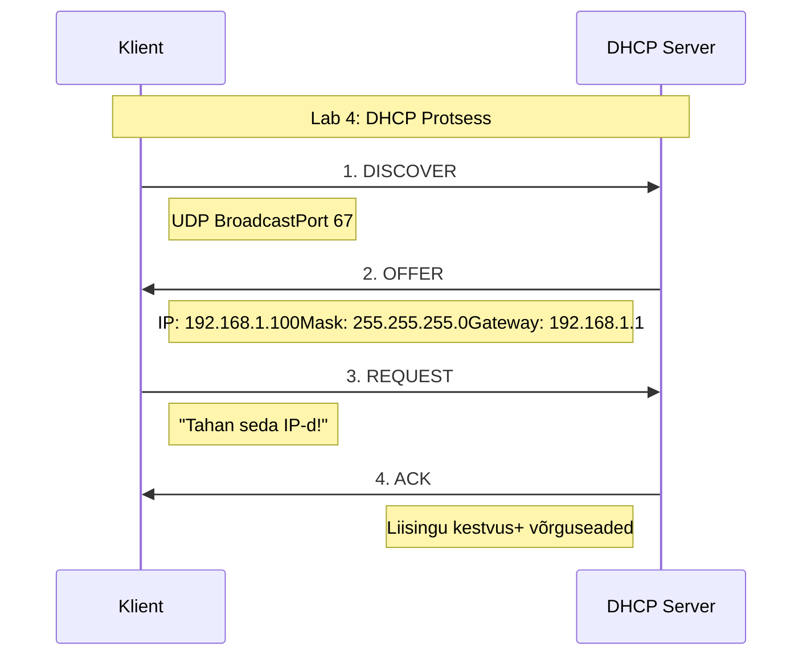

# 🌐 Võrguinfrastruktuur, DHCP ja DNS

## 📚 Sissejuhatus
Võrgud on tänapäeva digitaalse maailma selgroog. Kujutage ette, et kogu internet on nagu suur linn, kus:
- Võrgud on tänavad ja teed
- IP-aadressid on majade aadressid
- DHCP on nagu linnaplaneerimisametnik, kes määrab aadresse
- DNS on nagu digitaalne telefoniraamat

## 🏙️ Võrgutüübid: Detailne Ülevaade

### 1. LAN (Local Area Network)
- **Mis see on?** Piiratud ala võrk, näiteks:
  - Kontorihoone võrk
  - Kooli arvutiklass
  - Kodu võrk
- **Praktilised näited:**
  - Ethernet-kaabliga ühendatud arvutid kontoris
  - Wi-Fi võrk kodus
  - Printeriühendused kontoris

### 2. WAN (Wide Area Network)
- **Mis see on?** Laiaulatuslik võrk, mis ühendab kaugemaid punkte
- **Praktiline näide:**
  - Pank ühendab oma kontorid üle Eesti
  - Rahvusvaheline ettevõte ühendab kontorid eri riikides
- **Tehnoloogiad:**
  - MPLS: Kiire ja turvaline andmeedastus
  - SD-WAN: Tarkvarapõhine WAN-võrk

### 3. VLAN (Virtual LAN)
- **Mis see on?** Virtuaalne võrk füüsilise võrgu sees
- **Praktiline näide:**
  - Koolis on eraldi VLAN-id:
    * VLAN 10: Õpetajate võrk
    * VLAN 20: Õpilaste võrk
    * VLAN 30: Administraatorite võrk

### 4. WLAN (Wireless LAN)
- **Mis see on?** Traadita kohtvõrk
- **Igapäevased näited:**
  - Kodu Wi-Fi
  - Kohviku tasuta internet
  - Kontori traadita võrk

## 🎟️ DHCP: Detailne Selgitus

### DHCP protsessi skeem:




### Kuidas DHCP töötab? 
Kujutage ette restorani:
1. **DHCP Discover** = Klient siseneb restorani ja hüüab "Kas siin on vabu kohti?"
2. **DHCP Offer** = Kelner vastab "Jah, laud number 5 on vaba!"
3. **DHCP Request** = Klient ütleb "Jah, ma võtan laua number 5!"
4. **DHCP Acknowledge** = Kelner kinnitab "Laud 5 on teie oma järgmiseks 2 tunniks"

### DHCP jagab:
- IP-aadress (näiteks 192.168.1.100)
- Võrgumask (näiteks 255.255.255.0)
- Vaikelüüs (näiteks 192.168.1.1)
- DNS-serverid (näiteks 8.8.8.8)

## 🗺️ DNS: Praktiline Selgitus

### Kuidas DNS töötab?
Kujutage ette raamatukogu:
1. Külaline küsib "Kus asub raamat pealkirjaga www.google.com?"
2. Raamatukoguhoidja (DNS-server) otsib kataloogi:
   - Algab juurkataloogist (.)
   - Liigub com-kataloogi
   - Leiab google alamkataloogi
   - Tagastab täpse asukoha (IP-aadressi)

### DNS-i kirjed selgitustega:
```
A-kirje:      website.ee = 192.168.1.1
              (Nagu maja täpne aadress)

MX-kirje:     mail.website.ee = 10 mailserver.website.ee
              (Nagu postkasti asukoht)

CNAME-kirje:  www.website.ee = website.ee
              (Nagu maja teine sissepääs)
```

## 🔧 Praktiline Näide

Kui avate brauseri ja trükite www.example.com:

1. Teie arvuti küsib DHCP-serverilt IP-aadressi
2. DHCP annab teile IP konfiguratsiooni
3. Teie arvuti küsib DNS-serverilt "Mis on www.example.com IP?"
4. DNS vastab IP-aadressiga
5. Teie arvuti ühendub selle IP-ga


## 🔬 Laboratoorne töö (Lab 4)

Selles laboris õpime praktiliselt tundma DHCP ja DNS seadistamist:
- DHCP serveri paigaldamine ja konfigureerimine
- DNS serveri seadistamine ja haldamine
- Võrguteenuste testimine ja tõrkeotsing

## ⚠️ Tavalised Probleemid ja Lahendused

1. **"Ei saa internetiühendust"**
   - Kontrollige DHCP-liisingut: `ipconfig /all`
   - Uuendage DHCP-liisingut: `ipconfig /renew`

2. **"Veebileht ei avane"**
   - Kontrollige DNS-servereid: `nslookup website.com`
   - Puhastage DNS-vahemälu: `ipconfig /flushdns`
