# 🌐 Võrguinfrastruktuur, DHCP ja DNS

## 📚 Sissejuhatus
Võrgud on tänapäeva digitaalse maailma selgroog. Kujutage ette, et kogu internet on nagu suur linn, kus:
- Võrgud on tänavad ja teed
- IP-aadressid on majade aadressid
- DHCP on nagu linnaplaneerimisametnik, kes määrab aadresse
- DNS on nagu digitaalne telefoniraamat

## 🏙️ Võrgutüübid: Detailne Ülevaade

# 🌐 Võrguinfrastruktuur, DHCP ja DNS

## 🏙️ Võrgutüübid: Digitaalse Infrastruktuuri Alused

```mermaid
graph TB
    subgraph WAN[Wide Area Network]
        direction TB
        
        subgraph LK[" Kontor Londonis "]
            direction LR
            L_LAN[LAN]
            L_WLAN[WLAN/WiFi]
            subgraph L_VLAN[VLAN-id]
                L_V1[VLAN 10<br>Admin]
                L_V2[VLAN 20<br>Töötajad]
                L_V3[VLAN 30<br>Külalised]
            end
        end

        subgraph TK[" Kontor Tallinnas "]
            direction LR
            T_LAN[LAN]
            T_WLAN[WLAN/WiFi]
            subgraph T_VLAN[VLAN-id]
                T_V1[VLAN 10<br>Admin]
                T_V2[VLAN 20<br>Töötajad]
                T_V3[VLAN 30<br>Külalised]
            end
        end
        
        TK ---|Internet/VPN| LK
    end

    classDef lanStyle fill:#a8d5ff,stroke:#2196F3,stroke-width:2px
    classDef wlanStyle fill:#ffcca8,stroke:#FF9800,stroke-width:2px
    classDef vlanStyle fill:#d5a8ff,stroke:#9C27B0,stroke-width:2px
    classDef officeStyle fill:#f5f5f5,stroke:#333,stroke-width:2px
    classDef wanStyle fill:#f0f8ff,stroke:#2196F3,stroke-width:4px
    
    class L_LAN,T_LAN lanStyle
    class L_WLAN,T_WLAN wlanStyle
    class L_VLAN,T_VLAN,L_V1,L_V2,L_V3,T_V1,T_V2,T_V3 vlanStyle
    class LK,TK officeStyle
    class WAN wanStyle
```



### 1. LAN (Local Area Network)
- **Mis see on?** Piiratud ala võrk, näiteks:
  - Kontorihoone võrk
  - Kooli arvutiklass
  - Kodu võrk
- **Praktilised näited:**
  - Ethernet-kaabliga ühendatud arvutid kontoris
  - Wi-Fi võrk kodus
  - Printeriühendused kontoris

### 2. WAN (Wide Area Network)
- **Mis see on?** Laiaulatuslik võrk, mis ühendab kaugemaid punkte
- **Praktiline näide:**
  - Pank ühendab oma kontorid üle Eesti
  - Rahvusvaheline ettevõte ühendab kontorid eri riikides
- **Tehnoloogiad:**
  - MPLS: Kiire ja turvaline andmeedastus
  - SD-WAN: Tarkvarapõhine WAN-võrk

### 3. VLAN (Virtual LAN)
- **Mis see on?** Virtuaalne võrk füüsilise võrgu sees
- **Praktiline näide:**
  - Koolis on eraldi VLAN-id:
    * VLAN 10: Õpetajate võrk
    * VLAN 20: Õpilaste võrk
    * VLAN 30: Administraatorite võrk

### 4. WLAN (Wireless LAN)
- **Mis see on?** Traadita kohtvõrk
- **Igapäevased näited:**
  - Kodu Wi-Fi
  - Kohviku tasuta internet
  - Kontori traadita võrk

## 🎟️ DHCP: Detailne Selgitus

### DHCP protsessi skeem:

```mermaid
sequenceDiagram
    participant K as Klient
    participant D as DHCP Server
    
    note over K,D: Lab 4: DHCP Protsess
    
    K->>D: 1. DISCOVER
    Note right of K: UDP BroadcastPort 67
    
    D->>K: 2. OFFER
    Note left of D: IP: 192.168.1.100Mask: 255.255.255.0Gateway: 192.168.1.1
    
    K->>D: 3. REQUEST
    Note right of K: "Tahan seda IP-d!"
    
    D->>K: 4. ACK
    Note left of D: Liisingu kestvus+ võrguseaded
```




### Kuidas DHCP töötab? 
Kujutage ette restorani:
1. **DHCP Discover** = Klient siseneb restorani ja hüüab "Kas siin on vabu kohti?"
2. **DHCP Offer** = Kelner vastab "Jah, laud number 5 on vaba!"
3. **DHCP Request** = Klient ütleb "Jah, ma võtan laua number 5!"
4. **DHCP Acknowledge** = Kelner kinnitab "Laud 5 on teie oma järgmiseks 2 tunniks"

### DHCP jagab:
- IP-aadress (näiteks 192.168.1.100)
- Võrgumask (näiteks 255.255.255.0)
- Vaikelüüs (näiteks 192.168.1.1)
- DNS-serverid (näiteks 8.8.8.8)

## 🗺️ DNS: Praktiline Selgitus

### Kuidas DNS töötab?
Kujutage ette raamatukogu:
1. Külaline küsib "Kus asub raamat pealkirjaga www.google.com?"
2. Raamatukoguhoidja (DNS-server) otsib kataloogi:
   - Algab juurkataloogist (.)
   - Liigub com-kataloogi
   - Leiab google alamkataloogi
   - Tagastab täpse asukoha (IP-aadressi)

### DNS-i kirjed selgitustega:
```
A-kirje:      website.ee = 192.168.1.1
              (Nagu maja täpne aadress)

MX-kirje:     mail.website.ee = 10 mailserver.website.ee
              (Nagu postkasti asukoht)

CNAME-kirje:  www.website.ee = website.ee
              (Nagu maja teine sissepääs)
```

## 🔧 Praktiline Näide

Kui avate brauseri ja trükite www.example.com:

1. Teie arvuti küsib DHCP-serverilt IP-aadressi
2. DHCP annab teile IP konfiguratsiooni
3. Teie arvuti küsib DNS-serverilt "Mis on www.example.com IP?"
4. DNS vastab IP-aadressiga
5. Teie arvuti ühendub selle IP-ga


## 🔬 Laboratoorne töö (Lab 4)

Selles laboris õpime praktiliselt tundma DHCP ja DNS seadistamist:
- DHCP serveri paigaldamine ja konfigureerimine
- DNS serveri seadistamine ja haldamine
- Võrguteenuste testimine ja tõrkeotsing

## ⚠️ Tavalised Probleemid ja Lahendused

1. **"Ei saa internetiühendust"**
   - Kontrollige DHCP-liisingut: `ipconfig /all`
   - Uuendage DHCP-liisingut: `ipconfig /renew`

2. **"Veebileht ei avane"**
   - Kontrollige DNS-servereid: `nslookup website.com`
   - Puhastage DNS-vahemälu: `ipconfig /flushdns`
